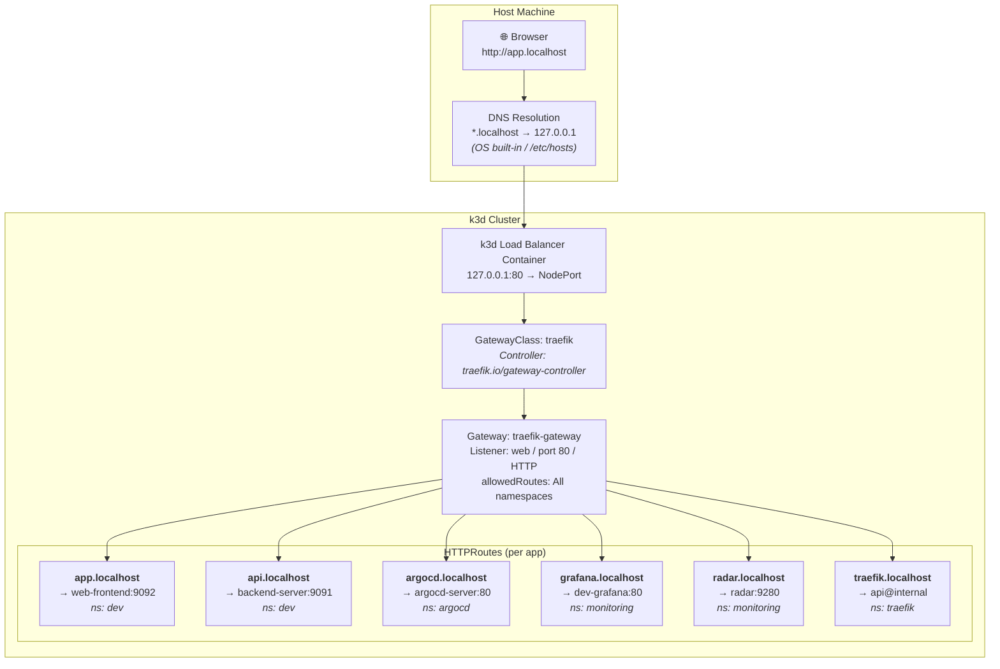
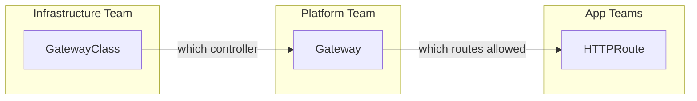
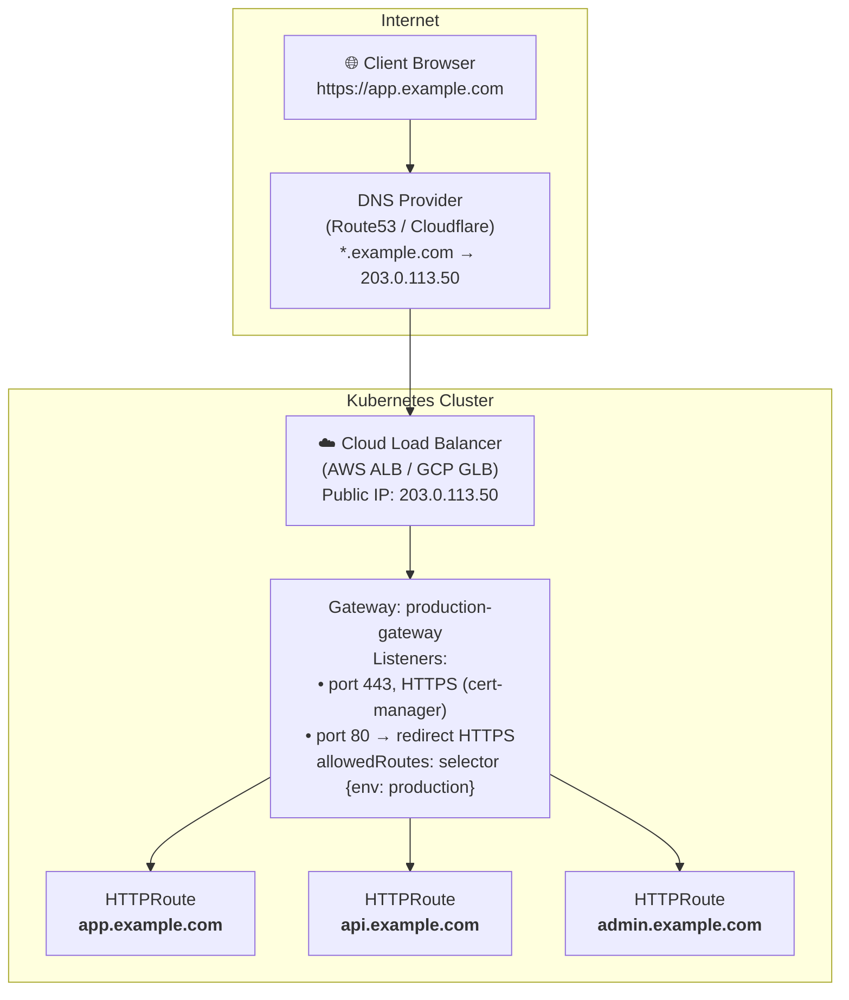

# Single IP → Multiple Apps via Gateway API

## Architecture Overview

All services share a single IP address (`127.0.0.1` port `80`) using the **Kubernetes Gateway API** — the production-grade successor to Ingress resources.



### DNS Resolution (Local Dev)

No manual `/etc/hosts` entries needed. The `.localhost` TLD is reserved by [RFC 6761](https://datatracker.ietf.org/doc/html/rfc6761) — the OS resolver always returns `127.0.0.1` for any `*.localhost` hostname. This is built into macOS and Linux.

| Hostname | Resolves to | How |
|----------|-------------|-----|
| `app.localhost` | 127.0.0.1 | OS built-in (RFC 6761) |
| `grafana.localhost` | 127.0.0.1 | OS built-in (RFC 6761) |
| `app.example.com` (prod) | Cloud LB IP | DNS provider (Route53, Cloudflare) |

## Why Gateway API over Ingress?

| Concern | Ingress (old) | Gateway API (current) |
|---------|---------------|----------------------|
| **Ownership** | Flat — anyone can create any route | Layered — platform controls Gateway, apps own HTTPRoutes |
| **Cross-namespace** | Implicit, no control | Explicit `allowedRoutes` policy |
| **Portability** | Controller-specific annotations | Standardized spec across controllers |
| **TLS policy** | Per-Ingress, scattered | Centralized on Gateway listeners |
| **Role separation** | None | GatewayClass (infra) → Gateway (platform) → HTTPRoute (app) |

## The Three Layers



| Resource | Owned By | Controls | Example Decision |
|----------|----------|----------|------------------|
| **GatewayClass** | Infrastructure team | Which controller implementation handles traffic | "We use Traefik, not Nginx" |
| **Gateway** | Platform team | Entry points, ports, TLS, which namespaces can route | "Port 443, HTTPS only, only `production` namespace" |
| **HTTPRoute** | App team | Hostname, path matching, backend service | "app.localhost → my-service:8080" |
| **ReferenceGrant** | Service owner | Which namespaces can reference my Service as a backend | "Only namespace `dev` can route to me" |

This separation means app teams can't accidentally expose services on wrong ports or override TLS policy — they can only attach routes within the boundaries the platform team defined on the Gateway.

### Layer 1: GatewayClass (Infrastructure Team)

```yaml
# Auto-created by Traefik Helm chart
apiVersion: gateway.networking.k8s.io/v1
kind: GatewayClass
metadata:
  name: traefik
spec:
  controllerName: traefik.io/gateway-controller
```

**Who manages it**: Traefik Helm chart (automatic)
**What it defines**: Which controller implementation handles traffic

### Layer 2: Gateway (Platform Team)

```yaml
# Managed by Traefik Helm chart via platform/traefik/values.yaml
# gateway.listeners.web.namespacePolicy.from = All
apiVersion: gateway.networking.k8s.io/v1
kind: Gateway
metadata:
  name: traefik-gateway
  namespace: traefik
spec:
  gatewayClassName: traefik
  listeners:
    - name: web
      protocol: HTTP
      port: 80
      allowedRoutes:
        namespaces:
          from: All
```

**Who manages it**: Traefik Helm chart (configured in `platform/traefik/values.yaml`)
**What it defines**: Entry point configuration, which namespaces can attach routes

### Layer 3: HTTPRoute (App Teams)

```yaml
# charts/web-frontend/templates/httproute.yaml
apiVersion: gateway.networking.k8s.io/v1
kind: HTTPRoute
metadata:
  name: dev-web-frontend
  namespace: dev
spec:
  parentRefs:
    - name: traefik-gateway
      namespace: traefik
  hostnames:
    - app.localhost
  rules:
    - matches:
        - path:
            type: PathPrefix
            value: /
      backendRefs:
        - name: dev-web-frontend
          port: 9092
```

**Who manages it**: App team (via Helm chart)
**What it defines**: Hostname, path matching, backend service

---

## Current Service Map

| Hostname | Route Type | Location | Backend Service | Namespace |
|----------|-----------|----------|-----------------|-----------|
| `app.localhost` | HTTPRoute | `charts/web-frontend/templates/httproute.yaml` | dev-web-frontend:9092 | dev |
| `api.localhost` | HTTPRoute | `charts/backend-server/templates/httproute.yaml` | dev-backend-server:9091 | dev |
| `argocd.localhost` | HTTPRoute | `platform/gateway/argocd-route.yaml` | argocd-server:80 | argocd |
| `grafana.localhost` | HTTPRoute | `platform/gateway/grafana-route.yaml` | dev-grafana:80 | monitoring |
| `radar.localhost` | HTTPRoute | `platform/gateway/radar-route.yaml` | dev-monitoring-radar:9280 | monitoring |
| `traefik.localhost` | IngressRoute | `platform/gateway/traefik-dashboard-route.yaml` | api@internal | traefik |

---

## How to Add a New Service

### Step 1: Add HTTPRoute template to your chart

```yaml
# charts/my-service/templates/httproute.yaml
{{- if .Values.httpRoute.enabled -}}
apiVersion: gateway.networking.k8s.io/v1
kind: HTTPRoute
metadata:
  name: {{ .Release.Name }}
spec:
  parentRefs:
    - name: {{ .Values.httpRoute.gatewayRef.name }}
      namespace: {{ .Values.httpRoute.gatewayRef.namespace }}
  hostnames:
    {{- range .Values.httpRoute.hostnames }}
    - {{ . | quote }}
    {{- end }}
  rules:
    - matches:
        - path:
            type: PathPrefix
            value: /
      backendRefs:
        - name: {{ .Release.Name }}
          port: {{ .Values.service.port }}
{{- end }}
```

### Step 2: Add defaults to values.yaml

```yaml
httpRoute:
  enabled: false
  gatewayRef:
    name: traefik-gateway
    namespace: traefik
  hostnames:
    - my-service.localhost
```

### Step 3: Enable in ArgoCD app manifest

```yaml
# apps/dev/4-apps/my-service.yaml
valuesObject:
  httpRoute:
    enabled: true
    hostnames:
      - my-service.localhost
```

### Step 4: Push → ArgoCD deploys → `http://my-service.localhost` works

---

## Production Equivalent



Differences from local:
- `*.localhost` → real DNS wildcard (`*.example.com`)
- Port 80 → Port 443 with TLS (cert-manager + Let's Encrypt)
- `allowedRoutes: All` → namespace selector for isolation
- Optional: ReferenceGrant for cross-namespace backend refs

---

## Troubleshooting

### HTTPRoute not working

```bash
# Check if Gateway is accepted
kubectl get gateway traefik-gateway -n traefik

# Check HTTPRoute status (should show "Accepted: True")
kubectl get httproute -A

# Describe for detailed conditions
kubectl describe httproute <name> -n <namespace>
```

### "Connection refused" on port 80

```bash
# Check Traefik pods are running
kubectl get pods -n traefik

# Check Traefik service has external IP
kubectl get svc -n traefik

# Check if port 80 is in use by another process
sudo lsof -i :80
```

### Cross-namespace route not attaching

The Gateway must allow routes from the target namespace:
```yaml
# In platform/traefik/values.yaml → gateway.listeners.web
namespacePolicy:
  from: All  # or use Selector for fine-grained control
```
