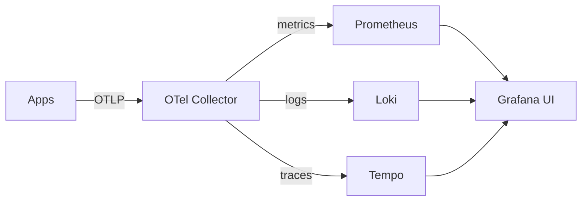
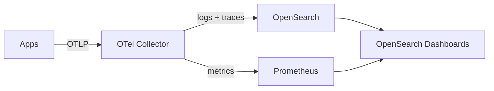
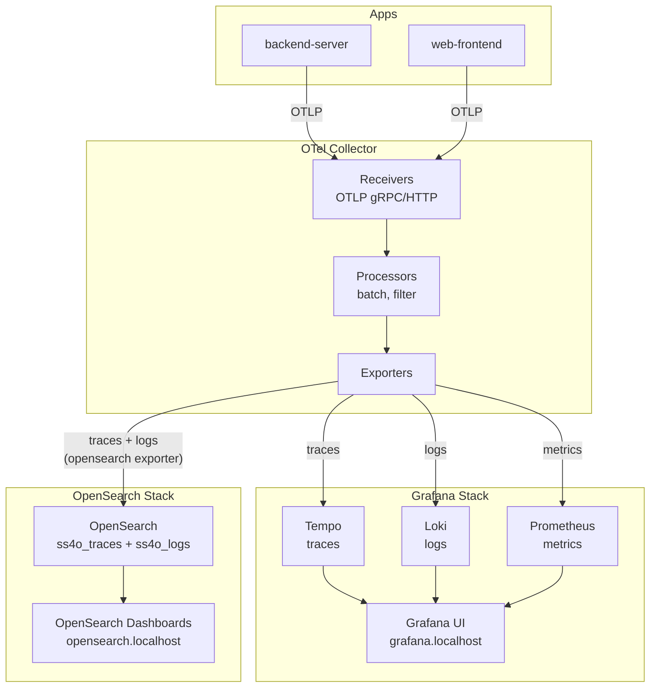
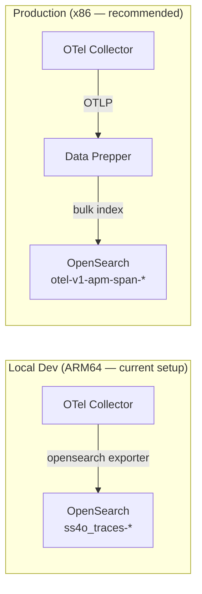
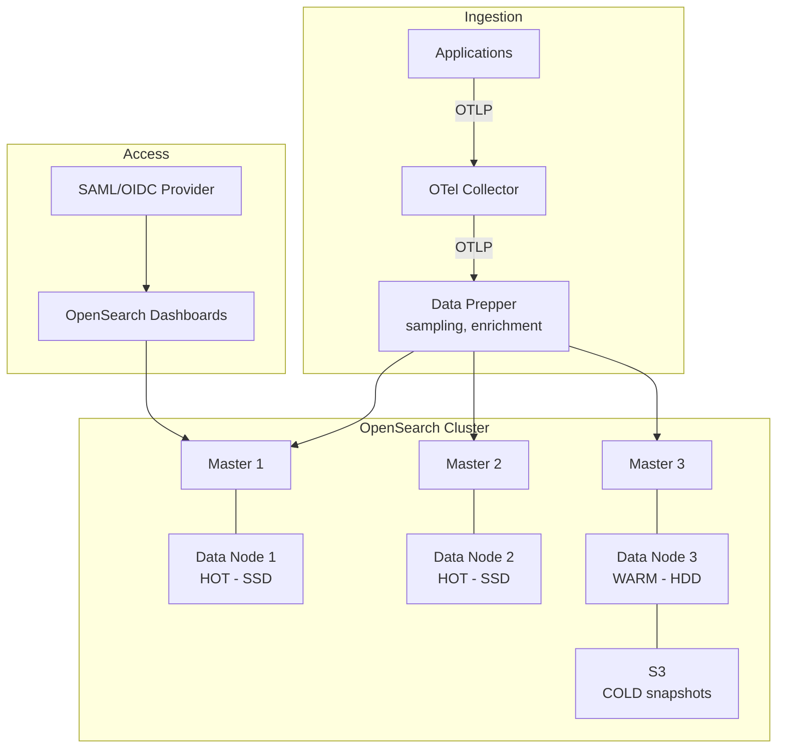

# OpenSearch Observability — Architecture & Tutorial

## Mental Model: Grafana vs OpenSearch

In Grafana world, each signal has its own specialized backend:



In OpenSearch world, **everything goes into one system**:



The key difference: OpenSearch stores everything as **JSON documents in Lucene indices**. There's no separate database per signal — it's all searchable text in one place.

---

## Architecture (Your Setup)



### Why No Data Prepper?

The official OpenSearch observability stack recommends Data Prepper between the OTel Collector and OpenSearch. However, **Data Prepper only ships linux/amd64** — no ARM64 image exists. On M1/M2 Macs with Colima/k3d, it crashes under QEMU emulation.

Instead, we use the OTel Collector's built-in `opensearch` exporter which writes directly in SS4O (Simple Schema for Observability) format. The Observability plugin in Dashboards needs custom index settings to read SS4O indices (see Tutorial Step 0).

On x86 production servers, Data Prepper would provide:
- Automatic service map generation
- `otel-v1-apm-span-*` indices that the plugin reads natively
- Trace sampling and enrichment



---

## Index Naming Convention

The OTel Collector's `opensearch` exporter writes in SS4O (Simple Schema for Observability) format:

```
ss4o_{signal}-{dataset}-{namespace}
```

| Signal | Index Name | Contents |
|--------|-----------|----------|
| Traces | `ss4o_traces-default-otel` | Trace spans as JSON documents |
| Logs | `ss4o_logs-default-otel` | Log records as JSON documents |

Each document has all OTel attributes flattened as searchable fields. You can query any attribute without pre-defining labels.

---

## Tutorial: Viewing Your Data

### Step 0: Configure Trace Analytics (one-time setup)

Since we use the direct `opensearch` exporter (no Data Prepper — unavailable on ARM64/M1), the Observability plugin needs to be pointed at our SS4O indices.

1. Go to `http://opensearch.localhost/app/settings#Observability`
2. Set the following:

| Setting | Value |
|---------|-------|
| **Enable APM** | On |
| **Trace analytics custom mode default** | **On** |
| **Trace analytics span indices** | `ss4o_traces-default-otel*,opensearch_dashboards_sample_data_otel_spans*` |
| **Trace analytics service indices** | `ss4o_traces-default-otel*,opensearch_dashboards_sample_data_otel_service_map*` |
| **Trace analytics correlated logs indices** | `ss4o_logs-*,opensearch_dashboards_sample_data_otel_logs*` |

3. Save changes

### Step 1: Create Index Patterns

1. Go to `http://opensearch.localhost/app/management/opensearch-dashboards/indexPatterns`
2. Click **Create index pattern** → select "Use default data source" → **Next step**
3. Enter: `ss4o_logs*` → **Next step** → Time field: `@timestamp` → **Create index pattern**
4. Repeat for `ss4o_traces*` with time field `@timestamp`

### Step 2: View Traces

1. Go to hamburger menu (☰) → **Observability** → **Traces**
2. You should see traces with latency, status, and service info
3. Click a trace to see the span detail view

### Step 3: View Services

1. Go to hamburger menu (☰) → **Observability** → **Services**
2. Shows service list with request rate, error rate, latency

### Step 4: Discover (Full-Text Log Search)

1. Go to hamburger menu (☰) → **Discover**
2. Select `ss4o_logs*` from the index pattern dropdown (top-left)
3. Set time range to **"Last 1 hour"** (top-right)
4. Search with DQL in the search bar

**Search examples:**
- `body: "http request"` — search log message body
- `severity_text: ERROR` — filter by severity
- `resource.service.name: backend-server` — filter by service
- `attributes.http.request.method: GET` — filter by HTTP method
- `trace_id: abc123def456` — find all logs for a specific trace

### Step 5: Alerting

1. Go to hamburger menu (☰) → **Alerting** → **Monitors**
2. Click **Create monitor** → "Per query monitor"
3. Index: `ss4o_logs*`
4. Query: `severity_text: ERROR AND resource.service.name: backend-server`
5. Condition: count IS ABOVE 5 (in last 5 minutes)
6. Add action: webhook, Slack, email

### Metrics

Metrics are NOT sent to OpenSearch in this setup (intentionally — Prometheus is better for metrics). Use Grafana at `http://grafana.localhost` for metrics dashboards.

### Note on Data Prepper (ARM64/M1 limitation)

The official OpenSearch observability stack uses Data Prepper between the OTel Collector and OpenSearch. Data Prepper creates `otel-v1-apm-span-*` indices that the Observability plugin reads natively without custom settings.

However, **Data Prepper has no ARM64 image** — it only ships linux/amd64. On M1 Macs with Colima/k3d, it crashes under QEMU emulation. The workaround above (direct exporter + custom index settings) achieves the same result.

On x86 production servers, use Data Prepper for the best experience.

---

## Query Language: DQL vs PPL

OpenSearch has two query languages:

### DQL (Dashboards Query Language) — used in Discover search bar
```
severity_text: ERROR
resource.service.name: backend-server AND body: "timeout"
span.status.code: 2
```

### PPL (Piped Processing Language) — used in Observability
```sql
source = ss4o_logs-default-otel
| where severity_text = 'ERROR'
| where resource.service.name = 'backend-server'
| stats count() by span_id
| sort - count()
```

### SQL (yes, actual SQL)
```sql
SELECT severity_text, body, @timestamp
FROM ss4o_logs-default-otel
WHERE resource.service.name = 'backend-server'
  AND severity_text = 'ERROR'
ORDER BY @timestamp DESC
LIMIT 50
```

---

## Key Differences from Grafana

| Concept | Grafana LGTM | OpenSearch |
|---------|-------------|------------|
| **Log query** | `{service_name="backend-server"} \|= "error"` (LogQL) | `resource.service.name: backend-server AND body: error` (DQL) |
| **Trace search** | TraceQL: `{resource.service.name="backend-server" && duration > 100ms}` | DQL: `resource.service.name: backend-server AND durationInNanos > 100000000` |
| **Metrics** | PromQL: `rate(http_requests_total[5m])` | Not ideal — use Prometheus for metrics |
| **Full-text search** | ❌ Loki can't search arbitrary substrings efficiently | ✅ Every word in every field is indexed |
| **Storage model** | Each signal has optimized storage (TSDB, chunks, object store) | Everything is Lucene inverted index |
| **Dashboard creation** | Visual panel editor, many chart types | Visualize tab, fewer chart types |
| **Alerting** | Grafana Alerting (multi-datasource) | OpenSearch Alerting (query-based monitors) |

---

## When to Use Which

**Use Grafana for:**
- Metrics dashboards (PromQL is unmatched)
- Quick label-based log filtering
- Trace waterfall views (Tempo + Traces Drilldown is excellent)
- Alerting on metrics thresholds

**Use OpenSearch for:**
- Full-text log search ("find this error UUID across all services")
- Compliance/audit (document-level RBAC, field masking)
- Ad-hoc investigation when you don't know which labels to filter by
- Long-term log retention with ILM tiering

**In your setup, both run side-by-side:**
- Same data flows to both (OTel Collector fans out)
- Use Grafana for day-to-day monitoring
- Use OpenSearch when you need to search for something specific in logs

---

## Metrics in OpenSearch?

OpenSearch CAN store metrics, but it's not great at it:
- No native TSDB (time-series database) optimizations
- No PromQL equivalent for aggregations
- Storage is 5-10x more expensive than Prometheus for metrics

The recommended approach (and what your setup does):
- **Metrics → Prometheus** (efficient, PromQL, Grafana dashboards)
- **Logs + Traces → OpenSearch** (full-text search, RBAC)

If you really want metrics in OpenSearch, the official stack uses **Prometheus as a sidecar** and OpenSearch Dashboards has a Prometheus plugin to query it. But it's simpler to just use Grafana for metrics.

---

## Production Considerations

For production (x86 servers), you'd enable:
1. **Data Prepper** — between OTel Collector and OpenSearch for service map generation, sampling, enrichment
2. **Security plugin** — RBAC, SAML/OIDC, audit logs, field-level security
3. **Multiple nodes** — 3 master + 2 data minimum for HA
4. **ILM policies** — hot (SSD, 7d) → warm (HDD, 30d) → cold (S3, 90d) → delete
5. **Snapshot repository** — S3 backups for disaster recovery

### ILM (Index Lifecycle Management) Flow


### Production Architecture


