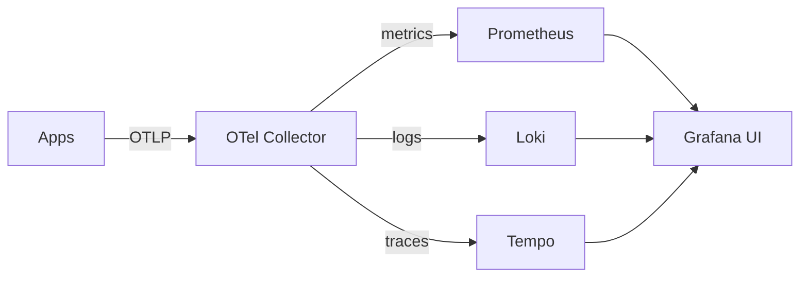
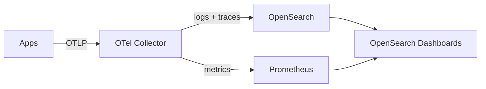
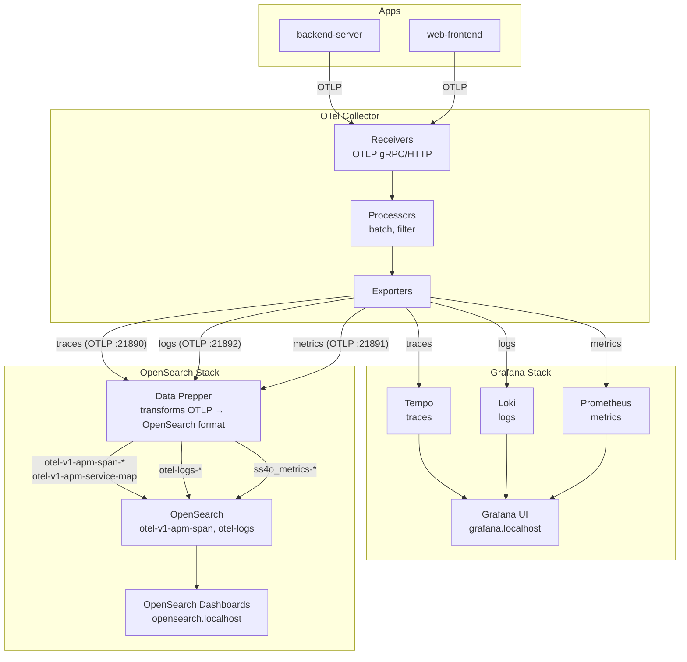
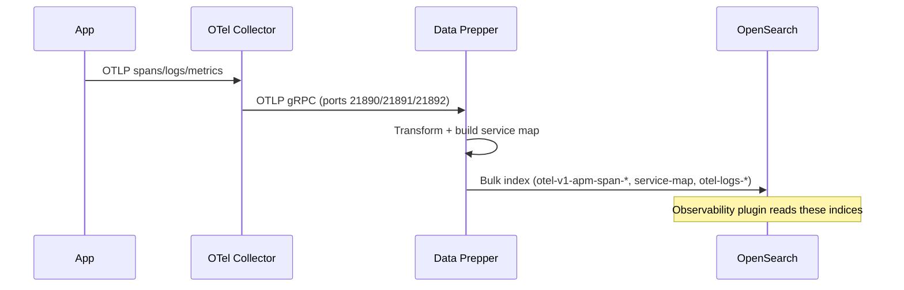
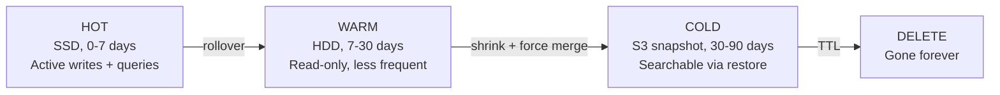
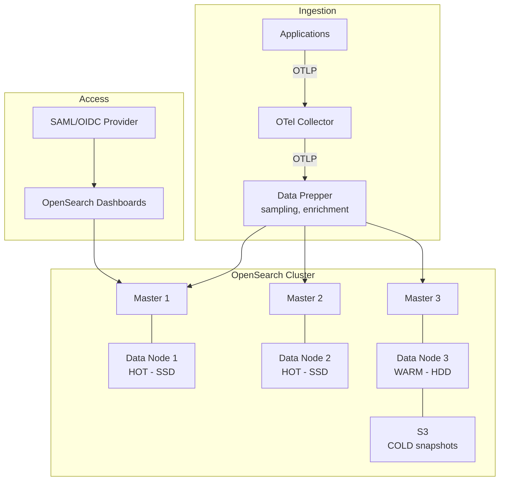

# OpenSearch Observability — Architecture & Tutorial

## Mental Model: Grafana vs OpenSearch

In Grafana world, each signal has its own specialized backend:



In OpenSearch world, **everything goes into one system**:



The key difference: OpenSearch stores everything as **JSON documents in Lucene indices**. There's no separate database per signal — it's all searchable text in one place.

---

## Architecture (Your Setup)



### Why Data Prepper?

The OTel Collector's direct `opensearch` exporter writes data in SS4O format, but OpenSearch Dashboards' **Observability plugin** (Traces, Services, Service Map) expects the **Data Prepper format** (`otel-v1-apm-span-*` indices). Data Prepper sits between the collector and OpenSearch to:

1. Transform OTLP spans into the format the Traces UI expects
2. Build the **service map** (which service calls which)
3. Create proper index templates with the right mappings
4. Handle metrics transformation (histogram buckets, etc.)



---

## Index Naming Convention

Data Prepper creates indices in the format the Observability plugin expects:

| Signal | Index Pattern | Created By |
|--------|--------------|------------|
| Traces (spans) | `otel-v1-apm-span-*` | Data Prepper trace pipeline |
| Service Map | `otel-v1-apm-service-map` | Data Prepper service_map processor |
| Logs | `otel-logs-*` | Data Prepper log pipeline |
| Metrics | `ss4o_metrics-otel-*` | Data Prepper metrics pipeline |

These are the indices that OpenSearch Dashboards' Observability plugin reads from automatically — no manual index pattern creation needed for Traces and Services views.

---

## Tutorial: Viewing Your Data

### Traces & Services (automatic — no setup needed)

1. Go to `http://opensearch.localhost`
2. Click hamburger menu (☰) → **Observability** → **Traces**
3. You should see traces with latency, status, and service info
4. Click a trace to see the waterfall/gantt view
5. Go to **Observability** → **Services** for the service map

Data Prepper creates the right indices automatically — the Observability plugin finds them without manual index pattern creation.

### Logs (create index pattern once)

1. Click hamburger menu (☰) → **Management** → **Dashboards Management** → **Index Patterns**
2. Click **Create index pattern**
3. Enter: `otel-logs*` → Click **Next step**
4. Select time field: `@timestamp` → Click **Create index pattern**
5. Go to **Discover** → select `otel-logs*` → see your logs

**Search examples (DQL):**
- `http request` — full-text search across all fields
- `severity_text: ERROR` — filter by field
- `resource.service.name: backend-server` — filter by service
- `body: "database connection"` — search log message body

### Metrics

1. Go to **Observability** → **Metrics**
2. Select a metric source from the dropdown
3. Browse available metrics from your applications

### Alerting

1. Click hamburger menu (☰) → **Alerting** → **Monitors**
2. Click **Create monitor**
3. Choose "Per query monitor"
4. Define a query like: `severity_text: ERROR AND resource.service.name: backend-server`
5. Set condition: "IS ABOVE 5" (more than 5 errors)
6. Add action: webhook, Slack, email, etc.

---

## Query Language: DQL vs PPL

OpenSearch has two query languages:

### DQL (Dashboards Query Language) — used in Discover search bar
```
severity_text: ERROR
resource.service.name: backend-server AND body: "timeout"
span.status.code: 2
```

### PPL (Piped Processing Language) — used in Observability
```sql
source = ss4o_logs-default-otel
| where severity_text = 'ERROR'
| where resource.service.name = 'backend-server'
| stats count() by span_id
| sort - count()
```

### SQL (yes, actual SQL)
```sql
SELECT severity_text, body, @timestamp
FROM ss4o_logs-default-otel
WHERE resource.service.name = 'backend-server'
  AND severity_text = 'ERROR'
ORDER BY @timestamp DESC
LIMIT 50
```

---

## Key Differences from Grafana

| Concept | Grafana LGTM | OpenSearch |
|---------|-------------|------------|
| **Log query** | `{service_name="backend-server"} \|= "error"` (LogQL) | `resource.service.name: backend-server AND body: error` (DQL) |
| **Trace search** | TraceQL: `{resource.service.name="backend-server" && duration > 100ms}` | DQL: `resource.service.name: backend-server AND durationInNanos > 100000000` |
| **Metrics** | PromQL: `rate(http_requests_total[5m])` | Not ideal — use Prometheus for metrics |
| **Full-text search** | ❌ Loki can't search arbitrary substrings efficiently | ✅ Every word in every field is indexed |
| **Storage model** | Each signal has optimized storage (TSDB, chunks, object store) | Everything is Lucene inverted index |
| **Dashboard creation** | Visual panel editor, many chart types | Visualize tab, fewer chart types |
| **Alerting** | Grafana Alerting (multi-datasource) | OpenSearch Alerting (query-based monitors) |

---

## When to Use Which

**Use Grafana for:**
- Metrics dashboards (PromQL is unmatched)
- Quick label-based log filtering
- Trace waterfall views (Tempo + Traces Drilldown is excellent)
- Alerting on metrics thresholds

**Use OpenSearch for:**
- Full-text log search ("find this error UUID across all services")
- Compliance/audit (document-level RBAC, field masking)
- Ad-hoc investigation when you don't know which labels to filter by
- Long-term log retention with ILM tiering

**In your setup, both run side-by-side:**
- Same data flows to both (OTel Collector fans out)
- Use Grafana for day-to-day monitoring
- Use OpenSearch when you need to search for something specific in logs

---

## Metrics in OpenSearch?

OpenSearch CAN store metrics, but it's not great at it:
- No native TSDB (time-series database) optimizations
- No PromQL equivalent for aggregations
- Storage is 5-10x more expensive than Prometheus for metrics

The recommended approach (and what your setup does):
- **Metrics → Prometheus** (efficient, PromQL, Grafana dashboards)
- **Logs + Traces → OpenSearch** (full-text search, RBAC)

If you really want metrics in OpenSearch, the official stack uses **Prometheus as a sidecar** and OpenSearch Dashboards has a Prometheus plugin to query it. But it's simpler to just use Grafana for metrics.

---

## Production Considerations

For production, you'd enable:
1. **Security plugin** — RBAC, SAML/OIDC, audit logs, field-level security
2. **Multiple nodes** — 3 master + 2 data minimum for HA
3. **ILM policies** — hot (SSD, 7d) → warm (HDD, 30d) → cold (S3, 90d) → delete
4. **Snapshot repository** — S3 backups for disaster recovery
5. **Data Prepper** — between OTel Collector and OpenSearch for enrichment/sampling

### ILM (Index Lifecycle Management) Flow



### Production Architecture


