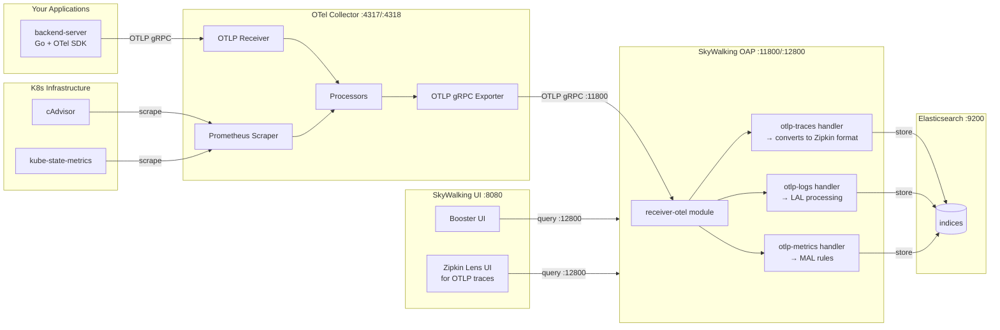

# Apache SkyWalking + OpenTelemetry Collector — Setup Guide

## Sources

- https://skywalking.apache.org/docs/main/next/en/setup/backend/opentelemetry-receiver/
- https://skywalking.apache.org/docs/main/next/en/setup/backend/otlp-trace/
- https://skywalking.apache.org/docs/main/next/en/setup/backend/log-otlp/
- https://skywalking.apache.org/docs/main/next/en/setup/backend/zipkin-trace/
- https://github.com/apache/skywalking-helm (chart v4.3.0)

---

## Architecture



---

## Step-by-Step Setup

### Step 1: Deploy SkyWalking via Helm

The SkyWalking Helm chart (v4.3.0) bundles Elasticsearch. Key values:

```yaml
# values.yaml
elasticsearch:
  enabled: true
  replicas: 1
  minimumMasterNodes: 1
  imageTag: "7.17.27"
  esJavaOpts: -Xmx1g -Xms1g
  # IMPORTANT: Disable PDB — uses deprecated policy/v1beta1 (removed in K8s 1.25+)
  maxUnavailable: ""
  persistence:
    enabled: true

oap:
  replicas: 1
  # REQUIRED: must be a string, not null
  storageType: elasticsearch
  image:
    tag: "10.2.0"
  javaOpts: -Xmx768m -Xms768m

ui:
  image:
    tag: "10.2.0"
  ingress:
    enabled: true
    hosts:
      - skywalking.localhost  # list of STRINGS, not objects
    path: /
```

**Chart quirks:**
- `oap.storageType` MUST be set as a string (null = template error)
- `ui.ingress.hosts` is a list of strings, NOT `[{host: ..., paths: [...]}]`
- `elasticsearch.maxUnavailable: ""` disables the broken PDB template
- `oap.env` is a **map** (key: value), not a list of `{name, value}` objects

---

### Step 2: Enable OTLP Handlers on OAP

SkyWalking's OAP server does NOT accept OTLP by default. You must enable handlers via env vars:

```yaml
oap:
  env:
    # 1. Activate the receiver-otel module
    SW_OTEL_RECEIVER: default

    # 2. Enable OTLP handlers for each signal
    SW_OTEL_RECEIVER_ENABLED_HANDLERS: otlp-metrics,otlp-logs,otlp-traces

    # 3. For METRICS: specify which MAL rule files to load
    #    Without this, OTel metrics are received but not processed
    SW_OTEL_RECEIVER_ENABLED_OTEL_METRICS_RULES: k8s/k8s-cluster,k8s/k8s-node,k8s/k8s-service

    # 4. For TRACES: otlp-traces converts OTLP → Zipkin format internally
    #    Zipkin receiver + query MUST be enabled or traces fail with
    #    "Application error processing RPC"
    SW_RECEIVER_ZIPKIN: default
    SW_QUERY_ZIPKIN: default
```

**What happens without each:**
| Missing env var | Error you'll see |
|----------------|-----------------|
| `SW_OTEL_RECEIVER` not set | OTel data silently dropped (no receiver active) |
| `otlp-traces` not in handlers | `Unimplemented: Method not found TraceService/Export` |
| `SW_RECEIVER_ZIPKIN` not set | `Application error processing RPC` on traces |
| `SW_OTEL_RECEIVER_ENABLED_OTEL_METRICS_RULES` not set | Metrics received but not stored (no MAL rules to process them) |
| Invalid rule name (e.g. `otel`) | `enabled rules not found: [otel{.yaml,.yml}]` — OAP crashes |

---

### Step 3: Configure OTel Collector Exporter

SkyWalking OAP accepts **standard OTLP gRPC** on port 11800 (same port as native protocol — both coexist):

```yaml
exporters:
  otlp/skywalking:
    endpoint: "<oap-service-name>.<namespace>.svc.cluster.local:11800"
    tls:
      insecure: true
```

Wire all pipelines to this exporter:

```yaml
service:
  pipelines:
    traces:
      receivers: [otlp]
      processors: [batch]
      exporters: [otlp/skywalking]
    metrics:
      receivers: [otlp, prometheus/cadvisor, prometheus/ksm]
      processors: [batch]
      exporters: [otlp/skywalking]
    logs:
      receivers: [otlp]
      processors: [batch]
      exporters: [otlp/skywalking]
```

**Important:** Do NOT use `otlphttp` exporter. While OAP supports HTTP on port 12800, the gRPC path on 11800 is more reliable and what the docs recommend.

---

### Step 4: Ensure Apps Set `service.name`

SkyWalking requires `service.name` resource attribute on all telemetry. Without it, data is dropped silently.

For **logs**, also recommended:
- `service.name` (required)
- `service.layer` (optional, default: `GENERAL`)
- `service.instance` (optional)

If your OTel Collector scrapes Prometheus metrics (cAdvisor, KSM), add a `resource` processor to set `service.name`:

```yaml
processors:
  resource/cadvisor:
    attributes:
      - key: service.name
        value: "kubernetes-cadvisor"
        action: upsert
```

---

### Step 5: Network Policies

Ensure your OTel Collector can reach OAP on port **11800**:

```yaml
# In the collector's network policy egress:
- to:
    - podSelector: {}
  ports:
    - protocol: TCP
      port: 11800
```

---

## Supported Protocols (OAP Server)

| Signal  | OTLP/gRPC (port 11800)      | OTLP/HTTP (port 12800) |
|---------|------------------------------|------------------------|
| Traces  | gRPC TraceService/Export     | POST /v1/traces        |
| Logs    | gRPC LogsService/Export      | POST /v1/logs          |
| Metrics | gRPC MetricsService/Export   | POST /v1/metrics       |

OTLP/HTTP supports both `application/x-protobuf` and `application/json`.

---

## Available Metrics Rules (built-in)

These are the rule files at `$CLASSPATH/otel-rules/` in the OAP image:

| Rule | Data Source | What it monitors |
|------|-------------|-----------------|
| `k8s/k8s-cluster` | KSM | Cluster-level K8s metrics |
| `k8s/k8s-node` | cAdvisor + KSM | Node-level metrics |
| `k8s/k8s-service` | cAdvisor + KSM | Service-level metrics |
| `vm` | node_exporter | Linux host metrics |
| `oap` | OAP self-telemetry | SkyWalking self-monitoring |
| `mysql/mysql-instance` | mysqld_exporter | MySQL metrics |
| `postgresql/postgresql-instance` | postgres_exporter | PostgreSQL metrics |
| `redis/redis-instance` | redis_exporter | Redis metrics |
| `istio-controlplane` | Istio | Istio control plane |

Set via: `SW_OTEL_RECEIVER_ENABLED_OTEL_METRICS_RULES: k8s/k8s-cluster,k8s/k8s-node,k8s/k8s-service`

**Label conversion:** Dots in OTel attribute keys become underscores in MAL rules.
Example: `k8s.pod.name` → `k8s_pod_name`

---

## Storage Options

| Storage | Notes |
|---------|-------|
| **Elasticsearch** (default) | Auto-inits via Job. Battle-tested. Use `imageTag: "7.17.27"`. |
| **BanyanDB** | Lighter but young (v0.8). Needs manual `-Dmode=init` + PVC. |
| **PostgreSQL / MySQL** | Via JDBC. Simpler but slower at scale. |
| **ClickHouse** | ❌ NOT supported as storage (only as a monitored target). |

---

## Viewing Data in the UI

| Signal | Where to find it |
|--------|-----------------|
| **Services (APM)** | Marketplace → General Service (shows services sending SkyWalking-native traces) |
| **OTLP Traces** | Marketplace → Services → select service → Trace tab. Or deploy Zipkin Lens UI. |
| **K8s Metrics** | Marketplace → Kubernetes → Cluster/Node/Service |
| **Logs** | Left sidebar → Dashboards → Log tab (if LAL rules match) |
| **Alerts** | Left sidebar → Alerting |

**Note:** OTLP traces appear under the "Zipkin" trace view, not the native SkyWalking trace view. This is because `otlp-traces` converts to Zipkin format internally.

---

## Troubleshooting

| Symptom | Cause | Fix |
|---------|-------|-----|
| `Unimplemented: Method not found TraceService/Export` | `otlp-traces` not in `enabledHandlers` | Add to `SW_OTEL_RECEIVER_ENABLED_HANDLERS` |
| `Application error processing RPC` (traces only) | Zipkin module not enabled | Set `SW_RECEIVER_ZIPKIN: default` + `SW_QUERY_ZIPKIN: default` |
| `enabled rules not found: [xxx]` | Invalid metrics rule name | Use exact built-in names (e.g. `k8s/k8s-cluster`) |
| `no provider found for module storage` | `storageType` null or invalid | Set `oap.storageType: elasticsearch` |
| `PodDisruptionBudget policy/v1beta1 not found` | Old ES chart | Set `elasticsearch.maxUnavailable: ""` |
| UI shows "No Data" everywhere | Data not flowing | Check collector logs for export errors |
| `connection refused :11800` | Network policy blocking | Allow egress to port 11800 |
| OAP `CrashLoopBackOff` | Liveness probe too aggressive during init | Increase `initialDelaySeconds` or wait for ES init Job |
| `wrong type for value; expected string` on `storageType` | Null value in Helm | Set `oap.storageType: elasticsearch` explicitly |
| `wrong type for value` on ingress hosts | Object instead of string | Use `hosts: [skywalking.localhost]` not `hosts: [{host: ...}]` |
