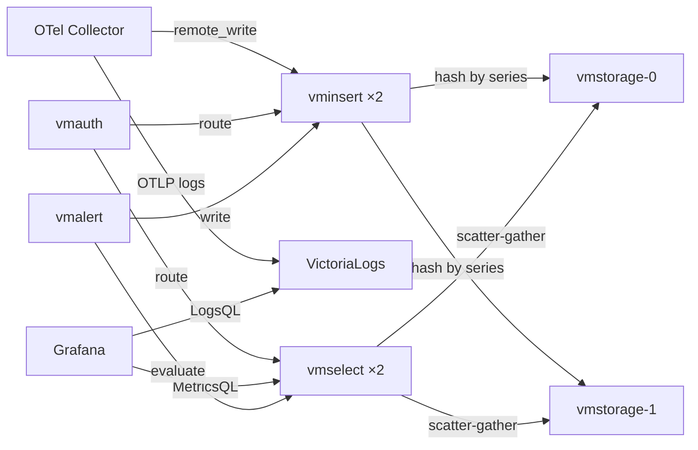

# VictoriaMetrics Stack (Production-Grade)

Full VictoriaMetrics observability stack with Grafana.



## Components

| Component | Chart | Mode | Purpose |
|-----------|-------|------|---------|
| VictoriaMetrics Cluster | `vm/victoria-metrics-cluster` | Cluster | Metrics TSDB (vminsert + vmselect + vmstorage) |
| VictoriaLogs | `vm/victoria-logs-single` | Single | Log database (LogsQL) |
| vmagent | `vm/victoria-metrics-agent` | StatefulSet | Scrape K8s + receive remote_write from OTel |
| vmalert | `vm/victoria-metrics-alert` | Deployment | Alerting & recording rules |
| Grafana | `grafana/grafana` | Deployment | UI — config in `../grafana/` |

## Helm Repos

```bash
helm repo add vm https://victoriametrics.github.io/helm-charts/
helm repo add grafana https://grafana.github.io/helm-charts
helm repo update
```

## Install

```bash
NS=monitoring

# VictoriaMetrics Cluster (metrics)
helm upgrade --install dev-vm vm/victoria-metrics-cluster \
  -n $NS -f victoria-metrics-cluster-values.yaml

# VictoriaLogs (logs)
helm upgrade --install dev-vlogs vm/victoria-logs-single \
  -n $NS -f victoria-logs-single-values.yaml

# vmagent (scrape + receive)
helm upgrade --install dev-vmagent vm/victoria-metrics-agent \
  -n $NS -f vmagent-values.yaml

# vmalert (alerting/recording rules)
helm upgrade --install dev-vmalert vm/victoria-metrics-alert \
  -n $NS -f vmalert-values.yaml

# Grafana (from unified grafana/ folder)
helm upgrade --install dev-grafana grafana/grafana \
  -n $NS \
  -f ../grafana/grafana-base-values.yaml \
  -f ../grafana/datasources-victoriametrics.yaml
```

## Architecture Decisions

- **Cluster mode for metrics** — production-ready with independent scaling of insert/select/storage.
- **Single-node for logs** — VictoriaLogs is efficient enough for single-node at moderate scale. Scale to cluster when needed.
- **No VictoriaTraces** — not yet GA. Use existing trace backend (Tempo/Jaeger) or add later when stable.
- **OTel Collector unchanged** — exporters for VM are added to `collector/exporters.yaml`, not here.
- **vmauth** — routes write traffic to vminsert and read traffic to vmselect. Single entry point.

## Endpoints (for common-values.yaml)

| Signal | Write | Read |
|--------|-------|------|
| Metrics | `vmauth:8427/api/v1/write` | `vmauth:8427` |
| Logs | `vlogs:9428/insert/opentelemetry/v1/logs` | `vlogs:9428/select/logsql/query` |

## Scaling Guide

| Bottleneck | Action |
|------------|--------|
| Write throughput | Add vminsert replicas (stateless) |
| Query latency | Add vmselect replicas (stateless) |
| Storage capacity | Add vmstorage nodes + rebalance |
| Log volume | Move VictoriaLogs to cluster mode |
